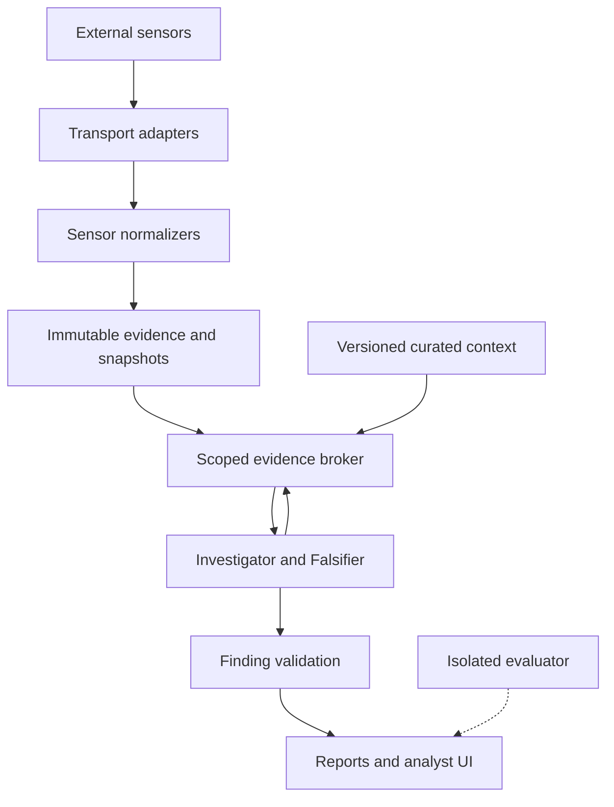
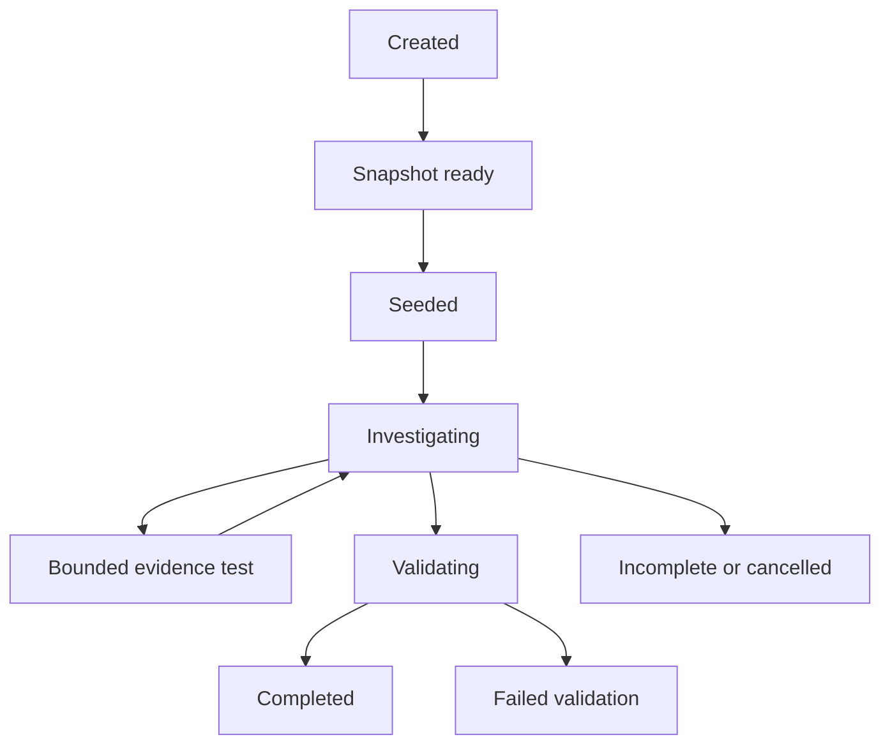

# Blue Cheese Master Architecture and Implementation Plan

Complete system design and implementation specification

Prepared for Albert Yoshimoto and CyberRIG | Version 1.0 | October 8 2026

## 1 Purpose and authority

Blue Cheese will be a lightweight, modular cybersecurity investigation system that turns sensor telemetry into traceable, qualified findings. It will ingest continuously, preserve original evidence, correlate related activity, investigate through bounded tools, deliberately search for counterevidence, and produce reports whose claims can be inspected against the exact records used. Its research focus combines EvidenceFalsifier, PoisonGuard and AnytimeSOC: falsification-driven reasoning, adversarial evidence provenance, and investigation under explicit resource budgets [P1].

This document is the master design and implementation roadmap. It consolidates the October 5 product design, the full Codex build prompt, the limited-session tasks, and the October 8 collector decision [P2-P4]. It specifies the complete intended architecture while preserving a small first deliverable. It does not establish that any component is already implemented. The repository was not supplied for inspection in this authoring task; actual implementation status must be established in Milestone M0. All performance limits, thresholds, schemas and APIs proposed here are design defaults until implemented and measured.

The audience is the project owner, a future coding assistant, a technical reviewer and a research evaluator. The document should let each identify what to build, where responsibilities belong, how failures are handled, what constitutes completion and which claims remain hypotheses. The master plan defines the destination; the one-session task list remains the constrained execution slice. If future repository facts conflict with this design, preserve working behavior, record an architecture decision and update the relevant contract before migration.

### Product thesis

The useful output is a supported answer to a scoped security question: what happened, which entities and observations support it, what alternative explanation was checked, what remains unknown, and what the analyst should inspect next. Blue Cheese is inspired by Security Onion's sensor-to-investigation workflow and by multi-source SIEM collection patterns. It will consume outputs from tools such as Suricata and Zeek without requiring a full Security Onion, Malcolm or Elasticsearch installation. It will measure whether this smaller deployment meets its own workload rather than claim feature parity or general superiority.

Five logical roles organize the finished workflow: Orchestrator, Triage, Correlation, Investigator and Reporter. The Investigator includes an explicit Falsifier policy. A role is a replaceable software responsibility; it need not be a separate process, independently running agent or LLM call. Deterministic triage and correlation are first-class implementations. The evidence broker is deterministic software, not an LLM trusted to police its own access.

### Scope boundaries

The initial application operates locally for one trusted operator, with native Linux/macOS development and optional Docker packaging. External sensors handle packet capture, protocol analysis and rule execution. Blue Cheese handles ingestion, investigation, evaluation and presentation. Public exposure, multi-tenant authorization, enterprise-scale distributed storage and automatic containment require separate milestones and are excluded from the first product release.

Read-only evidence retrieval is the default autonomy boundary. Recommendations may include checking an endpoint or considering containment; the application does not execute firewall changes, kill processes, quarantine hosts or send messages. A later response system would need explicit action authorization, target verification, impact bounds, rollback and a separately tested adapter. No future model provider may silently widen the existing tools' authority.

### Reading and maintenance guide

Sections 2-5 define requirements and structure; Sections 6-10 define evidence, ingestion and storage; Sections 11-16 define cases, agents, verdicts and providers; Sections 17-22 define user workflows, deployment, operations and testing; Sections 23-27 define research, milestones, decisions and handoff. Appendix A gives an illustrative end-to-end case; Appendix B records sources and their limits. Names in code examples are proposed interfaces, not assertions that these modules already exist.

## 2 Requirements and release boundaries

### Functional requirements

| ID | Requirement | Acceptance evidence |
| --- | --- | --- |
| FR01 | Import a labelled synthetic scenario without network access | Original bytes and normalized fields are inspectable by stable ID |
| FR02 | Follow a growing EVE file and resume from a durable cursor | Append, partial-line, crash and retry tests pass |
| FR03 | Replay fixtures through the real ingestion path | Counts increase while the application stays open |
| FR04 | Use common sensor and transport contracts | Fake non-file input works without changing agent code |
| FR05 | Preserve evidence identity, lineage and parser versions | Reprocessing adds interpretations without changing raw evidence |
| FR06 | Open, revise and investigate scoped cases | Case membership and each run's snapshot are reproducible |
| FR07 | Retrieve evidence only through typed, bounded tools | Scope, row, byte and time limits are enforced outside the model |
| FR08 | Test alternative explanations explicitly | Reports show the test, returned evidence and its effect |
| FR09 | Validate claim-level citations | Invented, unseen, out-of-scope and stale references are rejected |
| FR10 | Report uncertainty without erasing supported observations | Findings distinguish disposition, claim support and impact |
| FR11 | Compare clean and poisoned evidence under matched settings | Experiment manifests and evaluator-only labels remain separate |
| FR12 | Export auditable reports and run metadata | Exported references resolve without relying on a live UI |
| FR13 | Substitute model, sensor, store and retrieval implementations | Contract tests run against each supported implementation |
| FR14 | Expose source health and processing gaps | Unavailable telemetry and queue backlog are visible |
| FR15 | Enforce budgets and cancel long-running work | No additional call begins after budget or deadline exhaustion |

### Delivery profiles

| Profile | Included behavior | Explicit limitation |
| --- | --- | --- |
| Demonstration | Synthetic fixtures, mock provider, Investigator/Falsifier/Reporter, file replay, UI and exports | Demonstrates engineering behavior, not real-model detection quality |
| Dependable local product | Rotation recovery, real provider, cases, deterministic triage/correlation, source health, backup and retention | One trusted operator and one application runtime |
| Research system | Authentic datasets, baselines, provenance treatments, calibration, ablations and reproducible evaluation | Results apply to tested models, scenarios and evidence conditions |
| Extended product | Zeek, optional socket transport, curated retrieval, optional host telemetry and service facade | Extensions pass their own gates before becoming supported |

### Nonfunctional objectives

Correctness and recoverability precede throughput. The application must bound memory use, preserve raw evidence for retained records, avoid silent gaps, and remain usable when models fail. Dependency installation and tests must work without a running sensor or model. A 16-32 GB laptop and an optional quantized 3-8B model are engineering targets inherited from the project research direction, not verified hardware requirements [P1]. Larger models may be configured if available; no model size is assumed sufficient for security reasoning.

Proposed initial engineering budgets are a 1 second poll interval, up to 100 records per ingestion batch, a 500 millisecond flush deadline while a batch is accumulating, a 1 MiB ordinary record limit, and 8 MiB of buffered record bytes. These are starting values for a small lab workload. The 500 millisecond batch deadline starts after records are observed; it does not override the poll interval. Enforce both count and byte caps. Measure CPU, RSS, model memory, database size and spool growth separately.

## 3 Architecture principles and invariants

1. Raw evidence is immutable within its retention policy. Parsing, enrichment, case assignment and model interpretation are separately versioned derivatives.
2. Every accepted or quarantined occurrence is associated with a source identity, locator and content hash. Exact bytes remain recoverable unless a documented retention or truncation policy says otherwise.
3. A checkpoint never advances past an occurrence whose accepted, rejected or oversized disposition has not been durably recorded.
4. Normalization is deterministic and independent of model providers. Missing values remain missing; no guessed endpoint, severity or timestamp becomes an observed fact.
5. One process owns the local database runtime; one dedicated worker serializes its commands. An LLM call never holds a database transaction open.
6. A run uses a fixed evidence snapshot and fixed context versions. New observations create a later run or revision, not a silent alteration of an old conclusion.
7. Case, variant, snapshot and retrieval visibility are enforced in the evidence broker. Model-supplied IDs cannot expand access.
8. Telemetry, documents and previous model outputs are data. Their text cannot change tools, prompts, policy, budgets or configuration.
9. A citation's existence does not establish semantic support. Mechanical citation validation and claim-support evaluation are separate obligations.
10. Alert severity, triage priority, maliciousness, impact and confidence are distinct variables. No direct mapping converts sensor severity into a probability of compromise.
11. Queue notifications are expendable signals. Durable evidence and recoverable pending work determine what must be processed.
12. Evaluation ground truth, mutation manifests and injected labels are never included in agent-visible inputs. Their exclusion is tested.
13. Retries are explicit, bounded and idempotent where a durable operation is involved. Repeated provider calls still consume resources and are recorded.
14. New features preserve the offline fixture-to-report path. A milestone is complete only when its artifacts, checks and limitations are recorded.

## 4 Logical and physical architecture

### Logical component graph



The sensor plane contains external Suricata, Zeek and later endpoint or API producers. The ingestion plane owns transport readers, record framing, validation, quarantine, normalization and commit coordination. The evidence plane owns raw records, versioned interpretations, entity links, cases, snapshots and context versions. The investigation plane owns task scheduling, typed retrieval, hypotheses, counterevidence tests, budget enforcement and finding validation. The presentation plane owns analyst interaction and report rendering. A separate evaluation plane controls labels, mutations and metrics without becoming an evidence source.

The mandatory path is sensor output  ->  SourceReader  ->  raw envelope  ->  SensorPlugin  ->  NormalizedEvent  ->  EvidenceStore  ->  EvidenceBroker  ->  workflow  ->  validated report. Storage precedes dispatch. Curated context is a second evidence channel with its own identities and provenance. It may guide interpretation but cannot replace the telemetry needed to establish a factual claim.

### Physical runtime

The initial deployment is a single Python application process with a process-wide RuntimeManager. It owns a dedicated database worker, one or more bounded ingestion workers, a scheduler, a small investigation executor, and lifecycle state. Streamlit sessions use the same facade. Background workers never invoke Streamlit APIs. Database operations run on the owning worker; provider calls run outside it. Default model concurrency is one to avoid oversubscribing a local model or duplicating cost.

A portable exclusive lock on the canonical data directory prevents a second application runtime from opening the same database for writing. Resolve symlinks before constructing the lock path. Acquire the lock before migrations or worker startup. Reject conflicting CLI commands with a useful explanation; they may instead use another data directory or operate when the GUI runtime is stopped. Do not automatically delete a lock merely because a PID looks stale; use the lock library's ownership semantics.

DuckDB supports concurrency choices beyond this application design, and its capabilities evolve. The single-worker policy is a deliberate simplification for Blue Cheese's local native database, not a claim that all DuckDB deployments have this restriction [T4]. If long queries cause unacceptable ingestion latency after bounded queries and batching are tuned, introduce a measured alternative behind EvidenceStore. Do not solve a hypothetical scale problem with Kafka, Kubernetes or multiple databases in the first release.

### Trust and dependency boundaries

Domain models must not import Streamlit, provider SDKs or concrete database clients. Application services depend on protocols. Adapters depend inward on domain contracts. The UI calls application services; it does not run SQL or manage threads. The broker holds run-bound scope that callers cannot replace. Provider adapters return candidate outputs, never authoritative findings. Validators and policy controllers decide what is accepted.

Trusted execution includes shipped code, pinned dependencies, explicit configuration and local operator actions. Sensor output is attributed input, not automatically truthful input. A trusted sensor can record attacker-controlled strings. A previously valid context document can become outdated. An analyst note is separately attributed and timestamped rather than silently merged into a sensor observation.

## 5 Repository and module design

Adapt existing files to these responsibilities instead of moving working code for cosmetic conformity. The following is a proposed mapping, not a requirement to create every file at once.

| Module path | Owns | Must not own |
| --- | --- | --- |
| src/blue_cheese/domain | Event, case, hypothesis, finding and budget contracts | Framework or database imports |
| application/ingest.py | Read, normalize, commit and checkpoint use case | Sensor-specific JSON field knowledge |
| application/cases.py | Case revision and snapshot creation | Unbounded global evidence access |
| application/investigate.py | Workflow and state transitions | Provider-specific HTTP handling |
| application/runtime.py | Ownership, worker registry and shutdown | UI rendering |
| ports/sources.py | SourceReader and source capabilities | Suricata configuration |
| ports/stores.py | EvidenceStore transaction and query contracts | Arbitrary agent SQL |
| ports/providers.py | LLMProvider, capabilities and response types | Verdict acceptance policy |
| adapters/sources | File, replay input and later Unix socket readers | Investigation logic |
| adapters/sensors | Suricata, Zeek and later format mappings | Transport lifecycle |
| adapters/stores | DuckDB schema, migrations and SQL | Prompt construction |
| adapters/providers | Mock and OpenAI-compatible adapters | Data classification policy |
| evidence | Broker, tool schemas, provenance and scope checks | Evaluation labels |
| agents | Triage, correlation, investigator, falsifier and reporter policies | Direct sensor or filesystem access |
| evaluation | Fixture generation, labels, mutations, metrics and experiments | Production evidence-tool registration |
| ui and cli | Entry points and operator workflows | Independent runtime ownership |
| tests and docs | Contract fixtures, verification and durable context | Generated claims of unrun checks |

Use Python protocols or abstract interfaces and explicit construction in a composition root. Introduce one configuration model and dependency factory rather than global singleton imports. Frozen dataclasses are suitable for internal values; use a validated serialization layer at tool, provider, configuration and export boundaries. Reuse a compatible existing validation library if present. Avoid mixing unrelated validation frameworks.

Every adapter declares a name, contract version and capabilities. Initial registration is a dictionary in application startup. Third-party dynamic discovery is deferred until a real use case justifies it. A plugin is trusted executable code; registration does not imply sandboxing. Documentation must state how to add a sensor, source, provider and store without editing the agent workflow.

## 6 Canonical contracts and identity

### Raw record envelope

| Field | Type and rule |
| --- | --- |
| source_id | Persistent configured identity for a sensor feed, distinct from its current path |
| source_generation | Durable generation assigned when file continuity changes |
| transport | file, import, replay or unix_stream; replay remains explicitly labelled |
| sensor_instance_id | Identifies the observing sensor and its deployment/session context |
| sensor_format | suricata_eve, zeek_conn or another registered format |
| locator | Tagged structure; file offsets or durable socket spool positions |
| raw_bytes | Original framed record bytes; delimiter policy documented |
| content_sha256 | Hash of the exact preserved bytes under that policy |
| received_at | UTC-aware receiver time, separate from sensor event time |
| transport_session_id | Optional durable socket/session identifier |
| ingest_metadata | Framing version, observed path and acquisition warnings |

Preserve the newline delimiter either in raw_bytes or in an explicit framing field; choose once and test byte-for-byte reconstruction. Do not decode a partial UTF-8 sequence prematurely. File position is byte-based, not Python character count. Path changes do not automatically mean source identity changes. A source's configured identity survives relocation only through an explicit operator mapping.

### Normalized event

| Field group | Contract |
| --- | --- |
| Identity | event_id, raw_record_id, interpretation_id, schema_version, parser_version |
| Time | event_time_utc nullable, original_time, received_at, ingest_sequence |
| Source | source_id, sensor_instance_id, sensor_type, transport, source_locator |
| Classification | event_kind, native_event_type, native_category, parse_status |
| Endpoints | src_ip, src_port, dest_ip, dest_port, protocol, app_protocol |
| Correlation | flow_id scoped to sensor/session, transaction_id, community_id, host_id when observed |
| Alert | signature_id, signature, category, native_severity, mapped_severity, action |
| Protocol context | Explicit DNS, HTTP, TLS and flow extension objects when supported |
| Provenance | raw hash, parent IDs, transformation version, integrity status |
| Completeness | Missing fields, truncation, parser warnings and source gap references |

Normalize IP literals with an IP parser while preserving original text in raw evidence. Validate ports as integers in range 0-65535; missing ports are normal for some records. Do not turn invalid values into zero. Preserve protocol strings with a documented common mapping and an UNKNOWN value where needed. Hostnames are not equivalent to resolved IP addresses. Preserve Unicode strings, but escape them in displays and bound them in model input.

Event time may be absent or malformed. Keep the record as partial evidence with a warning if other fields are usable. Queries requiring event time exclude or separately report undated records; they do not silently substitute ingestion time. A time-window query response states its handling of undated events. Maintain source clock-offset estimates as metadata, never overwrite original timestamps to make events fit a hypothesis.

For Suricata, preserve the native distinction between alert records and flow/protocol context. flow_id is useful for associating records from the same sensor context [T2]. Zeek uid joins related logs in its own sensor context [T3]. Community ID may support cross-sensor connection matching when implementations, seed and tuple semantics agree. It is a candidate linkage key, not an event ID or proof that two sensors provide independent confirmation.

### Stable identities and versioned interpretation

Use canonical, length-delimited serialization rather than ambiguous string concatenation. A proposed occurrence identity is SHA-256(identity_version, source_id, generation, start_offset, content_sha256). Persist source_id and generation before accepting records. Never use randomized hash(), database row order, receive time or raw content alone. Identical records at two offsets remain different occurrences; retrying the same position yields the same occurrence.

An event_id identifies the sensor occurrence; interpretation_id identifies its normalization under a parser/schema version. If one raw record yields multiple normalized events, add a deterministic child discriminator and preserve their common raw parent. Parser upgrades append interpretations and change the active interpretation selection for future snapshots. Existing reports retain their selected interpretation IDs.

A socket adapter first assigns a durable receiver session and spool sequence; replay from that local spool reuses the assigned identity. A sender retransmission without a sender-supplied stable ID may be indistinguishable from a legitimate repeated record. Document that limitation and never claim exactly-once source delivery. Do not collapse records merely because they hash to the same bytes.

Variants share immutable unchanged event interpretations through membership references. Changed records receive new identities and evaluator-side parent links; injected records get a distinct identity namespace. A run queries one selected variant's membership, not the union of all records. Parent links that disclose an experimental mutation remain evaluator-only unless an analogous lineage fact would be available operationally.

### OCSF compatibility

Use a small internal common schema now. OCSF supplies a standardized vocabulary of categories, classes, attributes and reusable objects [T5]; it is a future interchange target. Pin a specific schema release before authoring mappings. Implement an export adapter with explicit field transformations and validation reports; retain native fields that have no chosen mapping. Unsupported mappings are omissions with explanations, not guessed class identifiers. Internal schema version and OCSF export version are separate. Claim conformance only for the validated mapped event classes.

## 7 Collector and transport architecture

SourceReader acquires framed occurrences; SensorPlugin parses and normalizes a sensor format; IngestionService coordinates storage. EventSource is an acceptable alias for SourceReader, not a second parallel abstraction. A conceptual contract follows; implement it with the repository's existing style.

```python
class SourceReader(Protocol):
    def open(self, checkpoint: Checkpoint | None) -> None: ...
    def poll_once(self, limits: ReadLimits) -> ReadBatch: ...
    def mark_committed(self, cursor: SourceCursor) -> None: ...
    def health(self) -> SourceHealth: ...
    def close(self) -> None: ...

class SensorPlugin(Protocol):
    def normalize(self, record: RawRecord) -> NormalizeResult: ...

class EvidenceStore(Protocol):
    def commit_ingest(self, batch: IngestBatch) -> CommitReceipt: ...
    def create_snapshot(self, request: SnapshotRequest) -> Snapshot: ...
    def execute_tool(self, scope: RunScope, query: ToolQuery) -> ToolResult: ...
```

ReadBatch includes records, the proposed consumed cursor, partial-buffer status and source health. mark_committed updates the reader's local acknowledged state after the store confirms durable commit; it does not send a delivery acknowledgment to Suricata. A failed commit keeps uncommitted data available for retry. Source capabilities include resumable, ordered_within_source, supports_replay and requires_listener. Do not pretend all transports have file semantics.

### File first

Implement SuricataFileSource for both finite import and continuous following. A finite import has a manifest and explicit end-of-input; a growing file has no final EOF until stopped. Paced replay is a producer writing a new file, then using the same file source. Preserve a clear label distinguishing fixture replay from current sensor observation. Never append replay records to an external sensor's own log.

Suricata supports EVE output via regular files and several other transports including Unix streams [T1]. Transport choice does not change the need for a common schema, provenance or bounded storage. Retained files make manual inspection and replay straightforward. File-following latency includes sensor buffering, filesystem visibility, polling, normalization and commit; measure the stages rather than infer performance from the word streaming.

### Optional Unix stream

Add SuricataUnixSource only after the dependable file path. Verify the exact selected Suricata release's connection direction, framing, reconnect and overload behavior using official documentation plus a controlled integration test. EVE output is separate from Suricata's command socket. Configuration examples must be version-labelled and must not be copied from development documentation as a promise about an installed release.

The receiver must handle frames split across reads, multiple frames in one read, partial multibyte characters, EOF mid-frame, oversized frames and reconnect. Use a restricted filesystem socket path with documented owner/group permissions. Refuse to unlink an unrelated existing filesystem object. Bind lifecycle belongs to the source adapter, not an LLM tool. A local spool may make received data recoverable, but cannot recover bytes lost before the receiver persisted them.

Choose one explicit overload policy: block within bounded limits, spool within a disk quota, or disconnect and report potential loss. Never assume backpressure is harmless to the sensor. Keep receipt-to-durable-spool and spool-to-database watermarks distinct. Failure experiments must stop the receiver, slow the database, fill the spool quota and restart both endpoints. Record gaps and unknown loss separately from exact dropped-record counters.

Do not enable file and socket collection for the same sensor stream simultaneously by default. If dual collection is necessary, define occurrence-level correlation, collision handling and ambiguity reporting first. Hash-only deduplication can erase legitimate repeated observations.

### Other collectors

Zeek begins with JSON conn, dns, http and ssl logs, preserving uid and native field names in extensions. A parser for tab-separated logs is a separate supported format with fixtures for headers, unset fields and type declarations. Syslog transport and syslog message format are different concerns; preserve receipt metadata and source clock information. API collectors need explicit pagination, cursor persistence, rate limits and authentication handling. Endpoint collectors need stable host/process identities, including PID reuse boundaries. None should be implemented as an empty advertised connector.

PCAP handling remains an external conversion workflow: record capture hash, sensor binary version, configuration/rules hash and generated log paths in an import manifest. Offline PCAP processing and packet replay on a network are different operations. Blue Cheese's default demonstration needs only the former or fixture log replay; it does not transmit captured traffic.

## 8 Ingestion state machine and recovery

### Source lifecycle

States are STOPPED, STARTING, RUNNING, BACKOFF, DEGRADED, DRAINING and FAILED. STARTING validates configuration, access, generation and checkpoint. RUNNING polls within limits. BACKOFF is a temporary read or commit failure with an interruptible retry timer. DEGRADED permits useful ingestion while recording gaps or unsupported records. DRAINING stops new reads and finishes or safely abandons uncommitted work. FAILED requires an explicit intervention and retains diagnostic state. An empty file or momentary EOF is healthy idleness, not failure.

Transitions are driven by the runtime and are idempotent. Repeated Start returns the same source worker identity; repeated Stop is safe. Source configuration changes require a controlled stop/reopen and an audit entry. A UI refresh retrieves status without executing start logic. Worker registries use canonical source identities rather than browser-session IDs.

### File framing and checkpoints

Open files in binary mode. Read bounded chunks into a bounded framing buffer. Extract only complete newline-terminated records while running. At finite import completion, handle an unterminated final record under an explicit import policy; do not silently apply that policy to a growing file. Normalize each complete record or produce a quarantine disposition. Keep the proposed cursor at the last completely disposed record boundary. If a batch fails, reread or retain its uncommitted records; never advance the durable cursor because bytes were merely read.

Start modes are resume, beginning and current_end. Resume is the default when a matching checkpoint exists. Beginning means process that generation from offset zero with identity-based deduplication. current_end is an intentional skip: record the skipped byte interval. If the current file ends in a partial record, mark that record as outside the starting scope and discard its remaining suffix through the next delimiter with a skip record; do not later parse the suffix as a complete JSON object. This behavior must be visible and tested.

File identity uses the configured source, persisted generation and observed file metadata. Inode/device values help detect replacement but are not durable universal identities across all platforms or copied files. Capture a bounded fingerprint where useful, and treat uncertain continuity as a gap requiring a new generation. A replay session has a new source identity unless explicitly replaying a previously committed occurrence set for recovery.

### Rotation and truncation

For rename-and-create rotation, keep the old descriptor open, drain complete records available there, and then switch to the new file generation. Detect a replacement at the original path while continuing to track the old descriptor. If the old file can continue receiving writes, define a bounded drain timeout and report possible trailing loss rather than wait indefinitely. Preserve separate cursors for the draining and active generations until the transition completes.

For detectable truncation, record the unread interval as unknown when it cannot be reconstructed, create a new generation and apply the configured reset policy. Rapid copytruncate followed by regrowth between polls may evade a size-only check. Do not claim complete rotation recovery under that condition. The first limited-session implementation may stop with a clear reset/gap message; dependable rotation recovery is a later gate, not a reason to delay a working demo.

### Oversized and malformed records

Malformed complete JSON is quarantined with exact bytes, locator, error category and parser version. Continue to later records. Unknown event types are stored as raw-only unsupported observations with an explicit disposition; they are not counted as normalized events. Strictly bound nesting, field count, numeric parsing and string lengths at the serialization boundary where practical. Do not allow a huge payload to defeat a nominal row-count limit.

Oversized lines need a separate strategy because preserving every byte in RAM defeats the size cap. Stream them to a quarantine spool while computing the hash, or retain a capped preview and a truncation declaration when disk quota is exhausted. Record total bytes observed when known. An exact archive is available only when the complete spool succeeded. Advance the source checkpoint only after the disposition is durable; a disk-full condition that prevents recording the disposition pauses ingestion.

### Transaction and crash boundaries

For the first release, store ordinary raw record bytes as database BLOBs in the same transaction as normalized interpretations, variant membership, quarantine metadata, checkpoint and pending-work row. This makes the most important ingestion atomicity guarantee concrete. The commit receipt contains the accepted identities, counts, durable cursor and committed sequence. Only after receipt does the reader acknowledge its local position and the runtime signal downstream work.

Large raw spools or later immutable segment archives need a manifest protocol. Write a temporary segment, flush it according to the durability policy, atomically rename it within the same filesystem, and commit its hash/path/length in the database before advancing the checkpoint. A crash before database commit leaves an orphan segment to reconcile; a committed reference to a missing segment is an integrity error and blocks affected evidence use. Garbage collection must not remove segments referenced by retained records or snapshots. An atomic file rename is not an atomic database transaction.

| Failure point | Expected recovery |
| --- | --- |
| Before a complete frame | Resume from committed offset and rebuild the partial buffer |
| After parse before transaction | Reprocess the same occurrence |
| During transaction | Roll back events, dispositions, checkpoint and pending work together |
| After commit before notification | Scheduler discovers durable pending work |
| After notification before processing | Pending work remains or is reclaimed after its lease expires |
| During provider call | Mark interrupted attempt; retain trace; resume only by explicit retry policy |
| During report export | Ignore incomplete temporary file and regenerate from persisted run |
| Archive segment exists without manifest | Reconcile orphan; do not expose as accepted evidence |
| Manifest exists but archive is missing | Record integrity failure and qualify affected reports |

### Counters and backlog

Track complete records observed, newly accepted occurrences, raw-only unsupported records, quarantined records, duplicates, intentionally skipped records/bytes, and pending partial bytes separately. For a completed batch, processed occurrences equal accepted plus raw-only plus quarantined plus duplicates plus intentional record skips. Byte-range skips may have unknown record counts; do not invent a reconciliation count. Current queue depth is transient state, not durable throughput.

Lag can mean unread bytes, time since last commit, or event-time age. Label each metric. Old timestamps in a replay do not establish an unhealthy live pipeline. Silence may be normal; only a configured expected heartbeat supports an inactivity warning. Source gaps become evidence-quality metadata available to the broker so absence of a matching event is interpreted correctly.

## 9 Evidence storage and database schema

### Storage layout

Use a configurable local data root containing evidence.duckdb, optional archive segments, quarantine spools, exports, logs, backups and a runtime lock. Keep replay inputs outside the external read-only sensor directory. Keep evaluator ground truth in a separate path that is not mounted into the application container by default. Raw evidence may contain sensitive strings, so apply restrictive file permissions and avoid logging full payloads in operational logs.

The logical schema below is normative at the relationship level. Concrete SQL types, indexes and migrations must be validated against the pinned DuckDB version. Prefix internal tables consistently; avoid an ORM that hides the transaction boundary if direct parameterized SQL is simpler.

| Table | Key and important fields | Purpose |
| --- | --- | --- |
| sources | source_id; config revision, sensor instance, capabilities | Persistent source registry |
| source_generations | source_id + generation; fingerprint, path, opened/closed | File/session continuity |
| source_checkpoints | source_id + generation; committed cursor and sequence | Restart position |
| raw_records | raw_record_id; source locator, BLOB or archive ref, hash | Immutable original occurrences |
| event_interpretations | interpretation_id; event_id, raw_record_id, parser/schema version, common fields | Versioned normalized views |
| ingest_dispositions | occurrence key; accepted/raw-only/quarantined/skipped, reason | Accounting and idempotence |
| source_gaps | gap_id; source, interval, type, known loss bounds | Evidence visibility limitations |
| variants | variant_id; dataset/scenario, membership revision | Clean or alternate evidence view |
| variant_members | variant_id + interpretation_id; active membership | Prevent variant mixing |
| entities | entity_id; type, namespace, normalized value | Hosts, addresses, domains and processes |
| event_entities | interpretation_id + entity_id + relation | Queryable entity participation |
| entity_links | link_id; endpoints, basis IDs, rule/version, interval | Versioned correlation assertions |
| cases and case_revisions | case_id + revision; scope, seed IDs, status | Investigation question and history |
| case_members | case_id + revision + interpretation_id | Explicit evidence membership |
| snapshots | snapshot_id; case revision, variant revision, watermark, versions | Frozen run evidence boundary |
| snapshot_members | snapshot_id + interpretation_id | Concrete retained membership |
| runs | run_id; snapshot, config/model/prompt hashes, state, budgets | Reproducible investigation |
| run_steps | run_id + step index; role, input/output refs, timing | Externally inspectable activity |
| tool_calls | call_id; run, typed args, status, result manifest | Query audit and visibility registry |
| tool_result_members | call_id + evidence/document ref | Exact evidence provided to a role |
| hypotheses and tests | run + hypothesis/test ID; support, alternatives, outcome | Falsification state |
| findings and claims | report revision + claim ID; status, references, limits | Validated output |
| context_documents | document/version/chunk; origin, hash, trust, timestamps | Curated context channel |
| work_items | work_id; idempotency key, state, lease, attempt | Recoverable scheduling |
| audit_events | audit_id; actor, operation, object, timestamp | Operator and runtime changes |
| schema_migrations | version; checksum, applied_at | Controlled database upgrades |

Evaluation labels and mutation manifests belong in an evaluator-owned store or files, not a table accessible through ordinary evidence tools. If a development database temporarily contains them, the production broker must still have no query path to those tables, and export tests must confirm exclusion. A separate store is preferred because it makes accidental leakage less likely.

### Query and index policy

Use typed parameters for values and an allowlist for selectable fields and sort keys. SQL identifiers cannot be made safe simply by passing value parameters. Tool callers never supply arbitrary SQL, file paths, table functions, extension names or SQL fragments. Disable unneeded external access and extension loading in the store configuration where supported by the chosen version, and verify this with integration tests.

Start with indexes or ordering appropriate to event identity, source position, time, case membership and common endpoint lookups. Profile real bounded queries before adding many secondary indexes. Keep normalized frequently queried fields in typed columns and sensor-specific extensions in structured JSON. Explain query limits and truncation in results. Large scans are background operator jobs with their own budget, not an implicit consequence of an agent's search term.

### Snapshot semantics

A high-watermark alone is insufficient when case membership, normalizations, context or entity links can change. Create a snapshot transaction that selects a case revision, variant membership revision, committed ingest watermark, exact interpretation IDs and eligible context/link versions. For small lab cases, materialize snapshot_members and context version references. This is easier to audit than maintaining a long-lived database transaction during model inference.

Every tool filters by snapshot membership. Late-arriving records with old event times belong only to future snapshots unless explicitly selected into a new case revision. Re-normalization does not alter a retained snapshot. Queries may include related records only if the snapshot was deliberately constructed with that neighborhood; an agent cannot expand it mid-run. If broader evidence is needed, create a successor run with an expanded snapshot and a parent_run_id.

Snapshots pin referenced data until their retention lease or associated report retention expires. Deleting a case from the active UI is not permission to delete evidence used by a retained report. Store a snapshot digest derived from sorted membership IDs and version references to detect unintended changes.

### Migrations and backup

Apply ordered migration scripts with checksums under the exclusive runtime lock before workers start. Back up before destructive migration. A migration either completes or leaves a recoverable prior state; test upgrade from at least the previous released schema. Preserve old normalized versions needed by existing reports. Unknown future schema versions fail closed with a clear compatibility error.

For initial backups, stop ingestion and investigations, drain store commands, checkpoint/close the database, and copy the consistent database plus referenced archive manifests and segments. Verify hashes and perform a restore test into another data directory. Never advertise copying a live database file without its required state as a guaranteed backup. A later online backup uses a documented engine-supported snapshot/export procedure and receives its own test gate.

## 10 Provenance and evidence quality

### Trust dimensions

Do not reduce trust to a single uncalibrated 0-1 value. Store distinct dimensions: authenticated or configured source identity, transport integrity, original versus derived content, field controllability, sensor health, observation completeness, parser confidence/status, context freshness, and dependence on other sources. Unknown is a meaningful state for every dimension. Trust metadata may be assigned only from observable acquisition facts or an explicit configuration assertion with provenance.

For example, an HTTP URL logged by a locally managed Suricata sensor has a known sensor origin but may be controlled by a remote attacker. A threat-intelligence assertion has an origin and retrieval date but may be wrong or stale. Two alerts generated from the same packet are related observations rather than two independent witnesses. A checksum confirms equality with retained bytes; it does not establish the truth of those bytes or protect against an attacker who can replace both the bytes and the checksum registry.

### Derivation graph

Maintain directed lineage from raw occurrence to normalized interpretation to aggregate/correlation to claim to report. Derived nodes record transform name, version, parameters and input references. Summaries do not become independent evidence. Previous generated reports carry generated_by and parent evidence references; if retrieved later, their original observation dependencies remain visible. Reject circular justification where a new claim cites a previous report that ultimately depends on the new claim's own unsupported assertion.

The first graph is relational edge tables, not a separate graph database. Bound neighbor expansion by entity type, time window, edge count and hop count. A graph edge labelled temporal_association is not relabelled causal merely because it appears in a timeline. Endpoint evidence is required for process ancestry; network flow logs cannot establish parent processes or file execution.

### Quality and missingness

Expose quality flags for missing timestamps, truncated payloads, unsupported event types, source gaps, parser failures and incomplete protocol visibility. A failed query returns an error status, not an empty successful result. An empty successful query states the available evidence boundary. Unknown sensor coverage prevents interpreting missing records as proof of benign activity.

Record origin and time range for policy assertions such as authorized scanner schedules. A signed maintenance approval can support an alternative explanation, but a generic asset note saying a host is safe cannot override observed suspicious behavior. Stale approvals should trigger a freshness warning and a narrower conclusion, not automatic rejection of all evidence.

## 11 Triage correlation and case management

### Triage

Triage decides what deserves investigation; it does not establish compromise. Inputs include sensor alerts, rule family, asset importance if configured, recurring patterns, related events and source health. Start with deterministic rules and a configurable priority ordering. Keep rule explanations and seed IDs in the work item. Unknown asset importance is not silently treated as low importance.

Use separate fields for sensor severity and triage priority. Group repeated alerts to reduce duplicate work while retaining their underlying occurrence IDs and counts. Cooldowns suppress repeated investigation triggers, not ingestion or evidence retention. A suppression rule has owner, reason, scope, expiry and audit history. Preserve a view of suppressed candidates so evaluation can count missed opportunities.

### Correlation

The first correlation rules connect same-sensor flow IDs, exact endpoint tuples within bounded time windows, matching DNS requests/responses, and explicit Zeek uid relationships. Later cross-sensor rules may use Community ID and observed host identities. Each link records its basis, evidence IDs, rule version, time tolerance and ambiguity. A shared public IP can represent multiple hosts behind NAT; an IP address may be reassigned. Preserve host identity intervals and avoid unrestricted transitive merging.

Use a configurable event-time window with allowed lateness for streaming grouping. Late records update a case revision or create a related case. Do not rewrite a completed report. A maximum case span, maximum entity count and maximum event count prevent a busy DNS server or gateway from merging an entire environment into one case. Show that a case was capped and preserve a pointer to additional candidates.

### Case contract

A case includes a question, trigger, seed observations, entity set, event-time range, source/variant scope, membership revision, priority, operator status, assigned policy and history. Case status is OPEN, INVESTIGATING, NEEDS_REVIEW, RESOLVED or ARCHIVED. Status is independent of verdict: an unresolved incident may be malicious; a completed investigation may remain uncertain. Human annotations never overwrite sensor facts or model outputs.

Case merge and split create new revisions and lineage. Runs retain the revision they used. Manual additions to a case record actor and reason. Adding a new record after a run does not cause the old run to cite it retroactively. If automatic reinvestigation is enabled, meaningful new evidence creates a debounced successor task. Only one active run per case revision is allowed by default.

## 12 Evidence broker and tool contracts

### Run scope and limits

Construct RunScope server-side from run_id, case revision, variant, snapshot, authorized context versions and budget policy. It is immutable during a run. Tool arguments may narrow scope but cannot widen it. Each call validates types, identifiers, requested limit, time interval and cursor. Use deterministic ordering with a stable tie-breaker. Opaque pagination cursors bind to the query and snapshot and cannot be reused across scopes.

Default tool limits are proposed as 100 rows, 64 KiB serialized output, 2 seconds of database work and 2 graph hops with at most 100 edges. Enforce whichever limit is reached first. An initial seed bundle may be capped at 20 representative records. These values are tuning defaults; tests must verify boundary behavior and reports must capture actual configuration. A tool result explicitly reports truncated, returned_count, total_count only when computed, next_cursor, warnings and query status.

| Tool | Input | Output and constraint |
| --- | --- | --- |
| get_event | event/interpretation ID | Exact scoped interpretation, selected raw view and provenance |
| list_alerts | bounded time/filter/page | Alert records only; no inferred incidents |
| find_events_by_ip | canonical IP, window, page | Matching source/destination roles and IDs |
| find_connections | endpoints/protocol/window | Observed flow groups and basis records |
| search_events | allowlisted fields, literal terms, window | Bounded matches with explicit search semantics |
| get_entity_neighborhood | entity ID, allowed relation, hops | Capped graph with association labels |
| get_case_summary | no broadening parameters | Deterministic counts and time/source coverage |
| get_source_coverage | requested source and time interval | Known gaps, health and visibility limitations |
| get_context | query, allowed collection, page | Versioned excerpts with origin and trust metadata |
| get_process_ancestry | process identity and bounds | Available only after a supported host adapter exists |

Unavailable tools are omitted from provider capabilities and return UNSUPPORTED if explicitly called through an old client. Never return fabricated empty process ancestry to keep a workflow running. Full raw payload access may be an analyst capability while the model receives a capped, redacted projection; the exact bytes remain available for audit. Tool output records which fields were withheld and which transform was applied.

### Visibility and audit

Before returning a result, persist a manifest of the evidence IDs and context chunk versions actually supplied, along with hashes of the serialized model-visible payload. Later claim validation uses that registry, not every record in the case. If a response is truncated before delivery, only delivered records become visible. A cancellation or network failure after broker execution records whether delivery is confirmed, unknown or not attempted.

Record call_id, role, tool/schema version, validated arguments, scope, start/end times, status, counts, byte size and budget charge. Store concise model actions and structured hypothesis states rather than private chain-of-thought. Operational logs avoid raw secrets and full prompt bodies by default; restricted research artifacts may retain sanitized prompts when necessary for reproducibility.

### Query safety

Literal search is the default. Arbitrary regex can have performance hazards and should require a bounded implementation or be excluded. Tool arguments containing instruction-like strings are treated as query data. SQL injection tests include quotes, wildcards, long strings and malformed identifiers. The broker does not execute shell commands, resolve arbitrary URLs, read arbitrary filesystem paths, load extensions or call external threat feeds just because a model requests them.

## 13 Agent workflow and orchestration

### Responsibilities

| Role | Inputs | Outputs | Initial method |
| --- | --- | --- | --- |
| Orchestrator | Case revision, policy and resource state | Run, schedule, transitions and stop reason | Deterministic state machine |
| Triage | Alerts and bounded context | Priority, grouping key and trigger explanation | Rules |
| Correlation | Event entities and time windows | Candidate links and case membership proposal | Deterministic joins |
| Investigator | Seed bundle and broker tools | Hypotheses, evidence requests and candidate claims | Mock then real provider |
| Falsifier | Hypothesis, basis and available tests | Observable countertest and result interpretation | Bounded policy then model-assisted |
| Reporter | Validated findings and stored evidence | Versioned JSON, Markdown and analyst view | Deterministic assembly |

Logical separation allows independent testing without forcing a conversation between five models. An optional generative narrative renderer may improve readability later, but the authoritative structured findings remain unchanged and its prose must be checked against them. A model may propose a tool call; the orchestrator decides whether the call is permitted and affordable.

### Run state machine



The core sequence is CREATED  ->  SNAPSHOT_READY  ->  SEEDED  ->  INVESTIGATING  ->  VALIDATING  ->  COMPLETED. INVESTIGATING may alternate evidence acquisition and falsification. Terminal alternatives are CANCELLED, FAILED and INCOMPLETE. Distinguish a completed run with an uncertain conclusion from an incomplete run due to a model timeout. A report can contain valid partial findings from an incomplete run if clearly labelled and mechanically validated.

Persist each state transition with expected prior state so duplicate work cannot advance a run twice. Work-item leases coordinate the local executor and restart recovery; they do not imply distributed consensus. On startup, classify abandoned RUNNING attempts as INTERRUPTED, retain their traces and offer a controlled retry. A retry creates a new attempt or successor run while preserving original costs and outputs.

### Hypothesis contract

A hypothesis has a stable per-run ID, a scoped proposition, entity/time boundaries, supporting evidence IDs, conflicting evidence IDs, alternative explanations, required observations and current support state. Proposed defaults allow up to three hypotheses to prevent unrestricted branching. Claims should be narrow enough to test: attempted scanning, transfer observed, execution observed and host compromise are different propositions.

The Investigator begins with actual seed evidence and retrieves additional evidence as needed. It must distinguish an observed rule alert from its explanation of that alert. A name such as malware download in a signature is a sensor label, not proof of execution. An HTTP success status is a response observation, not proof that downloaded content was malicious or executed.

### Falsifier contract

For each consequential hypothesis, the Falsifier proposes an observable test that could weaken it or distinguish it from a plausible alternative. Each test includes the hypothesis ID, alternative proposition, expected discriminating observation, supported tool, arguments, required sensor coverage, expected cost and interpretation rule. Reject tests that are impossible with available telemetry, merely repeat the initial query, or assert that absence proves safety without coverage evidence.

Test outcomes are SUPPORTS, CONTRADICTS, INCONCLUSIVE, NOT_OBSERVED_WITHIN_COVERAGE, UNAVAILABLE and TOOL_ERROR. The last two are operational/evidence limitations, not benign findings. Update only the proposition addressed by the test. An approved scan schedule may weaken a claim of unauthorized reconnaissance; it does not prove no unrelated compromise occurred.

The Falsifier can receive a compact hypothesis and the supporting basis while retaining access to the same broker. A reduced-context or blinded critic is an experimental condition, not an assumed improvement. Compare it with an ordinary second critic under matched total budgets. Multiple agents using one model and one evidence set are not independent statistical witnesses.

### Budget controller

Track tool attempts, successful tool results, provider attempts, input/output tokens when available, elapsed wall time, reserved estimated tokens, serialized evidence bytes and monetary cost only when known. Proposed first defaults are six tool attempts, three provider attempts, one schema-repair attempt included in those three, and a 60 second run deadline with provider-specific timeout configuration. Local models may require a longer explicit profile; do not silently increase deadlines or misclassify every timeout as uncertainty.

Before dispatch, reserve the worst permitted output tokens and expected input cost, compare against remaining limits, and reject calls that cannot fit. Reconcile actual usage after completion. Unknown usage is recorded as unknown with the reserved estimate; it is not zero. Retries and repair calls consume the same global budget. Tool pagination is additional acquisition, not a way around the call cap.

Start with a deterministic policy that prefers low-cost tests addressing an unresolved consequential proposition. Later compare fixed-order, random seeded, uncertainty-guided and model-selected acquisition. A heuristic value score is a ranking aid, not a measured probability. Record the chosen action, concise reason, cost estimate and stop condition. Stop when relevant propositions meet policy, no available test can change the decision, scope must expand, or a budget is exhausted.

## 14 Verdicts uncertainty and useful conclusions

### Separate the questions

Avoid a design in which incomplete knowledge about impact forces every observation into an undifferentiated UNCERTAIN bucket. Report several dimensions: disposition of the scoped activity, observed stage/impact, support for individual claims, evidence completeness, and operational next step. A malicious attempt may be well supported while successful compromise remains unknown. A benign explanation may be supported for one maintenance action without establishing that the host is globally safe.

Retain MALICIOUS, BENIGN and UNCERTAIN as the initial three-way compatibility verdict. Add structured qualifiers rather than immediately breaking existing exports. MALICIOUS means evidence meets a versioned policy for the scoped malicious activity; it does not automatically mean successful compromise. BENIGN requires a supported benign explanation within the scope; no alert, no response or no available telemetry is insufficient. UNCERTAIN means the selected proposition cannot be resolved under available evidence and policy. A display qualifier such as suspicious can express unresolved concern, but it is not a new calibrated class unless a later schema defines and evaluates it.

| Dimension | Proposed values | Example |
| --- | --- | --- |
| Disposition | MALICIOUS, BENIGN, UNCERTAIN | Malicious activity supported |
| Stage | attempt, communication, execution, persistence, impact, unknown | Attempt observed |
| Impact status | observed, not_observed, unavailable, conflicting | Compromise unavailable |
| Claim support | supported, partially_supported, contradicted, unsupported | Scan pattern supported |
| Completeness | sufficient_for_question, limited, conflicting, unavailable | Endpoint visibility unavailable |
| Action | review, gather_specific_evidence, monitor, close_scoped_case | Request endpoint execution evidence |
| Run status | completed, incomplete, failed, cancelled | Completed with limited impact visibility |

### Decision policy

Write a versioned decision_policy.yaml defining proposition-specific evidence requirements and exclusions. Initially use transparent rule-based acceptance of validated candidate findings. A mock provider must derive its candidate result from evidence features, not scenario IDs, injected flags or ground truth. A real provider proposes interpretations; deterministic validators ensure schema, scope and required basis. Semantic judgement remains a research question and cannot be fully solved by a citation lookup.

Do not require two sensors for every malicious decision. That would systematically abstain on valid single-sensor cases. Require evidence appropriate to the proposition and record dependence between observations. Conversely, several alerts from one underlying packet do not satisfy a policy requiring independent corroboration. A rule can support a narrow suspicious-payload observation without supporting attribution, intent or compromise.

The report must state the decisive observations, the strongest available alternative, the test performed and the exact missing observation that would change the decision. Avoid generic gather more data language when a specific query or source is known. If no affordable useful test exists, state why and preserve the supported claims already obtained.

### Confidence and calibration

Keep optional model-reported confidence separate from calibrated correctness probability. Store its scale, elicitation prompt and target proposition. Never convert a qualitative adjective into a fabricated decimal. A confidence value about maliciousness differs from confidence that the report is correct. If probabilities are absent or unsupported by the provider, omit them.

Calibration is a later offline task on held-out labelled data. Candidate signals include stated confidence, token statistics only when genuinely exposed, contradiction counts, evidence coverage, tool failures and provenance features. These may connect to the owner's uncertainty research, but token entropy is not automatically available through every OpenAI-compatible endpoint. Do not invent log probabilities or equate high token probability with factual correctness.

Fit a simple calibration or correctness model using scenario-separated training/validation/test sets. Report Brier score and reliability bins only for a clearly defined binary target and proper probability outputs; report AUROC for score discrimination, not as proof of calibration. Preserve model and calibration versions. Distribution shift or a provider change can invalidate the calibration and should trigger an uncalibrated label until re-evaluated.

### Abstention controls

Measure coverage, selective error, class-specific recall, benign false-positive rate and abstention reasons together. A model that abstains on every case must fail useful-coverage acceptance even if it makes no accepted wrong predictions. Record uncertainty caused by missing sources separately from uncertainty caused by contradictions, limited budget, invalid model output or genuine ambiguity.

Use a risk-coverage curve over a held-out threshold sweep; select the deployment threshold on validation data using a predeclared tolerated error and minimum useful coverage. Do not tune on test labels. In the synthetic regression suite, the clear malicious and benign-confounder fixtures must yield their evidence-supported dispositions, while the ambiguous fixture remains unresolved. Those deterministic checks establish regression behavior, not a general accuracy guarantee.

## 15 Providers prompts and structured output

### Provider abstraction

LLMProvider accepts a versioned request containing role, system policy, structured evidence bundle, allowed tool schemas, output schema, model settings, deadline and budget reservation. It returns a candidate message or tool request plus usage, latency, finish reason, provider identity and error metadata. Capabilities describe structured output, tool calling, seed control, token usage and log-probability availability. Capability absence must be handled explicitly rather than hidden behind guessed SDK defaults.

Implement a deterministic demo provider first, followed by one configurable OpenAI-compatible adapter if a real endpoint is available. Preserve an existing provider in the repository. An OpenAI-compatible endpoint may differ in tool-calling and schema support; run a small capability smoke test and record supported behavior. Model name is not sufficient identity: retain model artifact/revision when available, quantization, server version and relevant inference settings.

### Prompt construction

Version role prompts as files with hashes. Include the task scope, proposition definitions, permitted tools, evidence metadata, uncertainty vocabulary and output schema. Delimit untrusted telemetry and context clearly, but do not claim delimiters alone prevent prompt injection. Strip no original evidence from the archive; construct a separate model-visible projection with capped fields and redaction metadata.

Build context deterministically: seed observations, relevant source coverage, current hypotheses, selected supporting/contradicting records and concise tool summaries. Sort with stable keys. A summarizer must reference source IDs, identify omitted detail and preserve contradictions. Uncited summaries cannot become independent evidence. If the context limit is exceeded, apply a documented selection policy and record what was omitted; do not silently discard inconvenient counterevidence.

### Output validation and failures

Parse structured output with size and nesting limits. Validate enums, required fields, bounded arrays, ID syntax and references. Allow one bounded schema-repair attempt only if the run budget permits. The repair prompt receives validation errors and the original evidence scope; it does not gain new data. Persist invalid output in a restricted diagnostic artifact if appropriate, but never expose it as a valid report.

Provider errors are categorized as timeout, connection, authentication, rate limit, invalid response, unsupported capability or cancelled. Retry only retryable errors with bounded interruptible backoff and respect server guidance. Authentication failures do not loop. A provider failure leaves evidence available and the UI usable. Automatic fallback to another model is disabled by default because it changes experiment identity, privacy and cost; an explicit fallback policy records every attempt.

Remote provider use is opt-in per configuration profile. State which evidence fields may leave the machine and allow a redacted profile. Keep credentials in environment variables or an appropriate secret mechanism, not prompts, source control, reports or debug traces. A local model server is a separate optional process; its memory and availability are monitored separately from the application.

## 16 Curated context retrieval and adversarial evidence

### Retrieval lifecycle

Start with explicit, locally curated documents and deterministic lexical retrieval. Each document has document_id, version, chunk IDs, content hash, title, origin, collection, authored/retrieved/expiry timestamps, trust basis, access policy and generated-versus-original status. Index construction is reproducible and its configuration is hashed. Retrieval filters collection and version before ranking; rank scores do not imply truth.

Context snapshots pin document versions. Updates create new versions and invalidate only future retrieval caches. Cache keys include snapshot, query, policy, index version and redaction profile. A cache hit consumes recorded acquisition capacity according to the experiment's declared policy; it must not quietly grant one treatment extra information. Poisoned and clean runs use isolated caches.

Add embeddings only if they improve retrieval or investigation under a defined evaluation. Store embedding model/revision and chunking rules. Vector results need exact chunk citations and the same provenance checks as lexical results. There is no need for a separate vector database until a measured workload demands one.

### PoisonGuard experiment surfaces

Evaluate at least three distinct surfaces: attacker-controlled strings recorded in genuine telemetry; altered or injected log records from a compromised acquisition source; and poisoned context/enrichment documents. Their attacker capabilities differ and must not be pooled into one success rate. Preserve clean inputs and apply deterministic seeded transformations to copies. Store transformation manifests and ground truth only in the evaluator environment.

Candidate test categories include instruction-like URL/header text, misleading asset descriptions, conflicting timestamps, duplicated evidence intended to inflate apparent corroboration, and stale context. The goal is to measure whether conclusions and tool choices are manipulated, not merely whether a suspicious phrase is detected. Avoid embedding target answers in fixture names, IDs or visible metadata.

Defenses include typed tool contracts, instruction/data separation, provenance-aware evidence presentation, source coverage checks, cross-record contradiction tests, bounded retrieval, derived-evidence labels and deterministic output validation. Test each defense separately. A provenance label that says this record was injected is an oracle defense unless that fact would be available in operation; exclude such labels from realistic treatment conditions.

### Failure containment

The model cannot access evaluator files, modify source evidence, change trust labels, alter decision policy or execute responses. Repeated unsuccessful attempts to call unsupported tools consume budget and eventually terminate the run. Prompt-injection detections are warnings with their own false-positive analysis; they are not proof that all other content is safe. Preserve original and sanitized representations so the effect of sanitization can be evaluated rather than assumed beneficial.

## 17 Reports exports and analyst interface

### Report contract

Every report includes report_id/version, case revision, run/attempt ID, snapshot digest, scope question, disposition and qualifiers, concise summary, observed timeline, claims with evidence references, falsification tests and outcomes, unresolved questions, source coverage warnings, provider identity, configuration hashes, consumed resources, run status and creation time. State whether data is synthetic and whether the provider is deterministic. Distinguish confidence labels from probabilities.

Each claim has claim_id, text, proposition type, entity/time scope, support status, evidence references, counterevidence references and limitations. A reference points to an interpretation or document chunk plus the exact visible fields used. Numeric claims such as counts and durations are computed from stored data and verified deterministically. ATT&CK mappings, if provided, include a versioned reference and an explanation; a technique label is an interpretation, not observed attacker attribution.

The Reporter assembles accepted structures and evidence. It cannot upgrade UNCERTAIN to MALICIOUS for readability or remove contradictions to shorten the summary. Human edits create a report revision with actor/reason and preserve the model-generated original. A report's validation state is shown separately from its security conclusion.

### Export bundle

Export JSON and Markdown first. An auditable bundle contains report.json, report.md, run_manifest.json, tool_trace.jsonl, referenced normalized evidence, permitted raw evidence or archive references, context excerpt manifest and checksums. Ground truth and mutation manifests are a separate optional evaluator bundle, clearly labelled and never mixed into ordinary analyst exports. Redaction profiles mark withheld fields and preserve linkage without exposing secret values.

Write exports to a temporary path and atomically rename after successful validation. A bundle verifier checks hashes, schema, citation resolution and snapshot membership without running an LLM. Archive extraction/import rejects path traversal, unexpected symlinks, oversized members and duplicate path collisions. Imported reports are historical artifacts and do not become trusted new observations.

### UI navigation

The main views are Sources, Evidence, Cases, Investigation, Reports and Experiments. For the first demonstration these may be four tabs rather than six pages. Persistent indicators show data mode, provider, source health and active work. A single global Start Source operation belongs to the runtime; changing a browser filter cannot start another worker.

Evidence inspection pairs exact archived raw text with normalized fields and provenance. Large or unsafe payloads receive escaped previews and an explicit download/view action. Display filter scope, time basis, hidden/unsupported counts and truncation. Selecting a claim citation opens the specific interpretation used in that report, not whichever parser version is currently active.

Investigation displays the scoped question, current state, hypotheses, tool calls, countertests, supporting/contradicting evidence and budgets. It shows concise externally inspectable decisions, not hidden chain-of-thought. Cancelling work is visible and does not delete its trace. Findings distinguish attempted activity from observed impact and give a concrete next evidence request where possible.

The experiment view compares only compatible runs, displaying model, prompt, budget, snapshot/scenario lineage and treatment differences. If settings mismatch, show the differences and disable aggregate claims of paired comparison. Evaluator labels appear only in a separately marked evaluation mode. Use text plus color for status and accessible labels for controls.

## 18 Configuration and proposed command surface

### Configuration contract

Use a validated YAML or TOML configuration with explicit precedence: built-in defaults, configuration file, environment overrides for documented fields, and explicit CLI flags. Secrets are referenced, not serialized. Log the redacted effective configuration and its hash. Reject unknown keys in production profiles to catch misspellings; provide a deliberate migration path for renamed fields.

```yaml
schema_version: 1
runtime:
  data_dir: ./var/blue-cheese
  model_concurrency: 1
  auto_investigate: false
store:
  backend: duckdb
  memory_limit: 2GB
ingestion:
  poll_ms: 1000
  batch_records: 100
  batch_max_delay_ms: 500
  buffer_max_bytes: 8388608
  record_max_bytes: 1048576
sources:
  - id: lab-suricata
    reader: file
    sensor_format: suricata_eve
    path: ./inputs/eve.json
    start_mode: resume
provider:
  kind: mock
  model: deterministic-demo
budgets:
  tool_attempts: 6
  provider_attempts: 3
  schema_repair_attempts: 1
  run_deadline_seconds: 60
tools:
  max_rows: 100
  max_output_bytes: 65536
  query_timeout_seconds: 2
```

The schema-repair cap is nested within provider_attempts, not additional to it. Model timeout, context/token budget and remote-provider settings belong to provider-specific validated profiles. The database memory limit is a proposal and does not cap all Python, model or process memory. Validate total process memory separately. Paths resolve against an explicitly documented base, preferably the configuration file directory rather than an unpredictable working directory.

### Command contract

The following commands are an implementation target. They have not been run against an existing Blue Cheese repository. Register the blue-cheese entry point and use actual module paths in the README when implemented. Every mutating command reports the data directory and refuses conflicting runtime ownership.

| Command | Meaning |
| --- | --- |
| uv sync --locked | Install dependencies exactly from the committed lockfile |
| uv run blue-cheese doctor | Validate configuration, permissions, schema and optional provider capabilities |
| uv run blue-cheese import --manifest fixtures/demo/scenario.yaml | Import the declared fixture and its provenance |
| uv run blue-cheese replay --scenario demo --output ./spool/eve.json | Append paced fixture events to a separate demo file |
| uv run blue-cheese ui | Start the local UI and its single owning runtime |
| uv run blue-cheese investigate --case CASE_ID | Run the configured workflow with an exclusive runtime or service client |
| uv run blue-cheese export --run RUN_ID --output ./exports | Create a validated evidence bundle |
| uv run blue-cheese verify-bundle ./exports/BUNDLE | Check schema, hashes and citation resolution offline |
| uv run pytest | Run the default offline software suite |
| uv run ruff check . | Check Python lint rules in the repository |
| docker compose up --build | Build the application image and start configured containers |

The investigate CLI must not open the same database independently while the UI owns it. The initial implementation may require stopping the UI; a later optional local service client can route the command to the existing owner. Replay is allowed as a separate producer because it does not open the database. Do not expose a command as supported until its behavior and help text are tested.

## 19 Linux macOS and container deployment

### Native environments

Choose a mutually compatible Python/dependency set during M0 and commit a lockfile. Test native Linux and macOS paths without GNU-specific shell assumptions. Use pathlib, UTC-aware datetimes, portable locking and explicit encodings. Pin parser, schema and provider-adapter versions in run manifests. Intended architectures are Linux amd64/arm64 and macOS Intel/Apple Silicon; only tested combinations are marked supported.

Suricata/Zeek capture generally lives on an external Linux sensor, lab VM or separately configured container. Native macOS development uses imported logs, replay or logs delivered from that sensor. Network capture requires its own privileges and visibility; the application does not inherit those capabilities merely because it runs in Docker [T6].

### Application container

Use a pinned Linux Python base, the same lockfile as native development, a non-root runtime user, a read-only code layer where practical, persistent state volume and a separate writable temporary directory. Publish the UI to 127.0.0.1 by default. Mount the telemetry directory read-only rather than mounting a single eve.json file, so replacement files remain visible. Keep replay spool writable in its own mount. No privileged mode, host networking or Docker socket mount is required for the app.

Document UID/GID and volume ownership behavior and provide a preflight permission check. Do not solve permission failures with broad world-writable permissions. SIGTERM initiates bounded draining and persists state before process exit. Health checks distinguish process liveness from readiness; model unavailability should degrade investigations without declaring ingestion dead. Container restart resumes from durable checkpoints.

### Socket and model profiles

For optional socket ingestion, place sensor and receiver in a compatible Linux environment with a dedicated shared socket directory. Test socket permissions, startup order, restart and cleanup. A host-to-Docker-Desktop Unix socket assumption is not portable; the file/replay profile remains the cross-platform baseline until validated. Keep socket resources separate from read-only telemetry mounts.

A local model service may be native or separately containerized. Configure its endpoint explicitly and validate reachability. Loopback inside a container is not automatically the host's loopback. Provide platform-specific endpoint examples only after testing them. Record model memory, context limit, quantization and hardware separately from application resource use; avoid claiming a successful small-model demo proves every model will fit.

### Optional service evolution

When a second client genuinely needs access, introduce a narrow local API around the existing runtime rather than another process opening the database. Version requests, authenticate any non-local access, preserve scope and idempotency, and add cancellation/job status. Multi-user access requires authorization, audit identities and isolation beyond a localhost demo. Revisit the storage backend only after measuring concurrent workload and documenting migration requirements.

## 20 Operations observability and retention

### Operational signals

Emit structured logs with timestamp, severity, component, source/case/run IDs, operation, duration and error category. Do not include entire raw events, credentials or model prompts by default. Metrics include read/commit rates, quarantine/unsupported rates, source gaps, bytes behind, queue depth, database command latency, investigation queue age, tool timeouts, provider errors, budget stops, report validation failures and export success.

Measure source-to-store latency only when event timestamps and clocks support that interpretation; also measure receiver-to-commit latency, which is locally observable. Separate ingestion latency from investigation latency and analyst time-to-answer. Periodic system summaries are scheduler tasks, not ingestion logic. Start with logs and UI counters; a Prometheus/LGTM exporter is an optional adapter, not a mandatory monitoring stack.

### Capacity and scheduling

Use bounded queues with fairness between ingestion, UI queries and investigation tools. Cap query execution so a broad search cannot monopolize the store worker. Prioritize commit and lifecycle commands without starving read requests indefinitely. Keep automatic investigations debounced, limited to one active run per case, and subject to a global queue limit. When full, merge redundant triggers or record deferred work; do not silently discard the evidence that caused them.

Disk usage includes raw records, database indexes, temporary spill, archive segments, quarantine, logs, exports and model files. Report each category. Apply warning and pause thresholds before total exhaustion. A failed disk write stops checkpoint advancement. Recovery instructions must explain how to free non-pinned artifacts and resume without deleting the database as a first step.

### Retention

Set separate retention for active telemetry, case-pinned evidence, run traces, context versions, quarantine and exports. Proposed lab defaults can be established after observing actual data volume; do not promise indefinite raw retention. A retention job first computes a dry-run manifest of candidates and references, then deletes only unpinned objects under policy. Case closure alone does not remove report evidence.

Before deleting a retained report's supporting raw data, either retain a self-contained evidence bundle or mark the report's auditability limitation explicitly under a deliberate policy. Derived summaries never replace raw evidence without disclosure. Backups have their own retention and restore checks. Source gaps caused by operator deletion or retention are recorded when detectable.

### Runbooks

| Symptom | First check | Recovery boundary |
| --- | --- | --- |
| No incoming events | Source path, permission, producer status and partial tail | Do not reset a valid checkpoint merely because the source is quiet |
| Duplicate rows | Source identity/generation and occurrence key | Correct identity logic; preserve legitimate repeated events |
| Growing backlog | Commit/query latency, queue caps and disk | Slow optional investigations before risking evidence loss |
| Many UNCERTAIN results | Reason codes, coverage, timeouts and decision policy | Fix missing evidence or policy; do not force labels to look better |
| Model unavailable | Endpoint, capability and timeout diagnostics | Keep ingestion running; allow explicit mock mode for demonstration |
| Database locked | Active owning process and canonical data path | Stop the conflicting runtime or select another directory |
| Rotation gap | Old descriptor, new generation and producer rotation policy | Report unrecoverable interval; never invent missing records |
| Missing raw archive | Manifest/hash verification and backups | Block unsupported claim verification and restore if available |

## 21 Security and integrity design

Protect the evidence path against accidental corruption and hostile input without pretending a local Python application is a hardened multi-tenant platform. Threat surfaces are telemetry strings, imported files, context documents, model responses, provider endpoints, plugins, configuration and exports. The most important security controls also improve correctness: bounded parsing, immutable evidence, explicit scope, typed tools and audited configuration.

File readers operate only on configured paths. Imports restrict archive extraction to a managed directory, reject traversal and bound decompressed size. UI rendering escapes telemetry and disables unsafe log-supplied HTML. Treat spreadsheet-oriented CSV export carefully so values beginning with formula characters are not executed by spreadsheet software; preserve an untouched raw export separately when required. Prefer JSON for machine exchange.

External enrichment is disabled by default. A future fetch adapter needs endpoint allowlists, redirect limits, response-size/time caps and explicit handling of internal network addresses to prevent a model-supplied URL from becoming unrestricted network access. Secrets are redacted before provider transmission and diagnostic export, with tests covering nested fields. Redaction must not silently destroy the evidence needed to interpret the result; disclose its scope.

Audit policy changes, source reconfiguration, case revisions, manual report edits and retention operations. Hash manifests detect accidental changes relative to a retained reference; strong tamper resistance against an administrator requires an external trust anchor or append-only destination beyond the initial product. State that boundary clearly. Security testing must distinguish implementation controls from unproven resistance to every prompt-injection strategy.

## 22 Software verification and acceptance

### Test pyramid

Default tests are offline, deterministic, isolated in temporary directories and independent of Docker, sensor installation, model downloads and external services. Use pytest and established repository tooling, with ruff and scoped coverage if compatible. Test behavior and invariants rather than reproducing implementation line-for-line. Fake clocks, scripted readers and poll_once seams avoid flaky sleeps.

| Layer | Required checks |
| --- | --- |
| Unit | Field mappings, timestamps, IP/port validation, IDs, line framing, budgets and policy |
| Contract | Each source, sensor, store and provider satisfies its declared interface |
| Integration | Real DuckDB transactions, broker scope, snapshots, raw preservation and tool traces |
| Regression | Semantic golden results for clear malicious, benign-confounder, ambiguous and poisoned fixtures |
| Recovery | Failure injection at every commit/notification/export boundary |
| Pipeline | Import/replay through validated report and bundle verification |
| UI | Selection, citation inspection, source controls, rerun behavior and comparison settings |
| Platform | Locked installs and core tests on supported Linux/macOS targets |
| Container | Build, non-root launch, volume persistence, SIGTERM and restart |
| Performance | Sustained ingestion, bounded backlog/memory, query latency and optional model profiles |
| Security | Scope bypass, injection strings, unsafe paths, payload limits and secret leakage |

### Critical fixtures

Maintain a compact seeded suite containing a malicious activity case, an authorized-maintenance confounder, an insufficient-visibility case, a contradictory-evidence case, duplicate bytes at distinct positions, missing optional fields, invalid timestamps, IPv6, split UTF-8, malformed JSON, oversized lines, unsupported event kinds, source replacement and late arrivals. Fixture names and IDs must not reveal labels to the agent. The evaluator may use descriptive names outside agent-visible metadata.

A normalization golden includes exact input bytes, parser version, expected typed fields and warnings. A finding golden includes proposition, verdict, support status, cited IDs and unresolved tests. Exclude volatile timestamps and measured durations from semantic equality, but validate their type/range separately. Golden updates require a reviewed reason and cannot be used automatically to hide regressions.

### High-risk invariant tests

Assert that a transaction failure advances neither cursor nor event membership; retry yields one accepted occurrence; two identical lines at distinct offsets remain distinct; partial lines produce no premature events; rename rotation drains the old file; unrecoverable truncation produces a gap; and a second writer is rejected. Test a crash after commit but before notification and confirm pending work is recovered.

Assert snapshot membership excludes later ingests and later parser versions; case/variant references cannot cross boundaries; unseen citations are rejected; context version changes do not alter a completed run; and an empty tool result differs from a timeout. Inject instruction-like telemetry and verify it cannot change tool registration or policy. Test evaluator-label exclusion through the complete serialization path, not just by checking one prompt template.

Assert budgets include failed attempts and repairs; cancellation prevents new calls; provider outputs cannot alter run scope; mock results depend on evidence rather than labels; and the BENIGN decision requires its specified supporting explanation. Test all-abstain output as a failing useful-coverage result in evaluation validation. Test malformed structured output without allowing arbitrary retry loops.

### UI and release gates

Use Streamlit AppTest for supported interactions and call it a simulated UI integration test. Separately launch the application and perform a manual or browser-driven journey when tooling permits. Verify raw/normalized views, citation navigation, start/stop, replay counts, cancellation and export. Import success alone is not a launch test.

For deterministic core modules, retain an 85% coverage target from the earlier plan, with explicit module scope and exclusions. Coverage is a diagnostic, not a substitute for failure-path tests. Release gates require passing lint and offline suites, tested migration/restore behavior for storage changes, accurate platform status and no unresolved invariant failure. Report PASS, FAIL or NOT VERIFIED for each gate rather than implying that intended support was tested.

### Performance experiment specification

Use a reproducible generated stream and then representative real logs. Proposed test points are 10, 100 and 1000 records per second, with varied record sizes and burst factors. These are workloads to measure, not promised capacities. Hold total records, sensor event mix, storage medium, runtime limits and hardware constant across comparisons. Measure no-model ingestion separately from ingestion with concurrent investigations.

Report achieved throughput, receiver-to-commit p50/p95/p99, unread backlog, dropped/unknown gaps, peak RSS, CPU and disk growth. For file versus socket, use the same records and normalization/store path; include sensor output buffering and receiver persistence configuration. A faster transport that loses data under restart does not satisfy the dependable-ingestion gate. Define the supported workload envelope from observed results and leave untested rates unclaimed.

## 23 Research evaluation and scientific claims

### Research questions

H1 asks whether explicit evidence-seeking falsification reduces unsupported and confidently wrong conclusions compared with a tool-using Investigator under matched resources. H2 asks whether observable provenance and evidence-dependence metadata reduce manipulation without unacceptable loss of clean performance. H3 asks whether a budget-aware acquisition policy retains useful investigation quality with fewer calls, tokens or seconds. H4 asks whether the effects persist across at least two model families or sizes and a held-out scenario family. These are proposed hypotheses inherited from the research direction, not established advantages [P1].

The research unit should be a scoped case or attack scenario, with claim-level annotations nested inside it. Individual log rows from one attack are correlated and must not be treated as thousands of independent experiments. Keep detection/classification, attack-story reconstruction, semantic claim support and operational cost as distinct evaluation tasks. A flow classifier cannot be compared directly with a full investigation system using one undifferentiated accuracy number.

### Dataset progression

Begin with synthetic fixtures for software regression and controlled failure examples. Next import an authentic investigation-oriented dataset with documented access, license, labels, time scope and sensor coverage. ATLAS is relevant because it addresses attack-story recovery [R7]; Clouseau is relevant as an existing tool-using multi-agent investigation baseline [R8]. Verify artifact availability and reproduce a manageable subset before committing to a dataset-wide claim. Network-only Suricata inputs and host provenance logs require different adapters and question scopes; do not invent process events to make the schemas appear interchangeable.

Use scenario-level development, validation and locked test partitions. Keep clean/poisoned pairs, near-duplicate scenarios and variants from the same underlying attack in the same partition. Fit any supervised baseline, calibration model or threshold only on the appropriate development split. Freeze prompts, mappings and policy before the held-out evaluation. If a test result motivates a change, designate a new untouched test set or report the work as exploratory.

CAGE Challenge 4 and the supplied MARL papers provide useful precedents for role decomposition, partial observability and budgeted action selection [R4-R6]. Their simulated defender actions and reward metrics are not direct ground truth for LLM interpretation of Suricata alerts. A later CybORG adapter would be a separate experimental environment, with explicit observation and action mappings; it is not required for the present system and does not justify training an RL controller now.

### Baselines and ablations

| ID | System | Question answered |
| --- | --- | --- |
| B0 | Sensor/rule baseline with deterministic report | Does an agent add useful information beyond existing alerts? |
| B1 | Single LLM with fixed event window | What does static context reasoning achieve? |
| B2 | Investigator with typed tools | What is gained by active evidence retrieval? |
| B3 | Investigator plus generic critic | Is another model turn sufficient? |
| B4 | Investigator plus explicit Falsifier | Does targeted counterevidence acquisition add value? |
| B5 | B4 plus provenance-aware presentation | Does observable provenance improve robustness? |
| B6 | B5 plus budget-aware acquisition | What quality-cost tradeoff does the policy achieve? |
| O1 | Evaluator-selected relevant evidence | Exploratory oracle context comparison, not deployable baseline |

Hold model, initial evidence, total call/token ceilings and allowed tools constant for the comparison they are intended to isolate. Report actual resource use as well as ceilings. A Falsifier uses part of the shared budget, not free additional calls. A second comparison may allow equal wall time or equal cost, but label it separately. The oracle condition may receive evaluator information only as an explicit reference condition; do not call it a formal upper bound without proving that interpretation.

Do not run the full Cartesian product at first. Start with B0/B2/B4 on a small labelled set, then add the critic control, provenance ablation and poisoning surfaces. Expand models and budget levels only after the harness and annotations are reliable. Repeat stochastic runs with recorded seeds where supported, while noting that a seed does not guarantee identical provider execution.

### Metrics and denominators

| Metric | Definition and interpretation |
| --- | --- |
| Coverage | Resolved MALICIOUS/BENIGN cases divided by eligible evaluated cases |
| Selective error | Incorrect resolved cases divided by resolved cases; undefined if none resolve |
| Overall unresolved rate | UNCERTAIN cases divided by eligible cases, with reason breakdown |
| Malicious recall | Correct malicious cases divided by all labelled malicious cases; abstentions count as unresolved misses for this measure |
| Benign false-positive rate | Benign cases labelled MALICIOUS divided by all labelled benign cases |
| Citation validity | Mechanically valid references divided by all emitted references |
| Supported claim fraction | Fully supported factual claims divided by adjudicated factual claims |
| Unsupported claim fraction | Unsupported factual claims divided by adjudicated factual claims |
| Evidence recall | Retrieved relevant evidence divided by annotated relevant evidence, only where labels are adequate |
| Manipulation success | Paired eligible cases meeting a predeclared attacker objective divided by attempted eligible cases |
| Robustness change | Paired clean-to-poisoned change in the chosen metric, reported by attack surface |
| Efficiency | Tool/provider attempts, tokens, latency, peak memory and known cost per case |
| Calibration | Brier score and reliability analysis for a defined probability target |

For three-way output, report a confusion table including UNCERTAIN. If computing binary precision/F1 on resolved cases, label the restricted denominator and show coverage alongside it. Do not reward abstention by excluding difficult cases without disclosure. Empty factual reports require a completeness/usefulness score so they cannot achieve an apparently perfect claim-support result by making no claims.

Annotate claim support using a rubric and, where practical, two blinded reviewers with disagreement resolution. Evaluate factual support separately from whether the ultimate label happens to be correct. Use paired scenario-level confidence intervals or bootstrap resampling at the scenario level; repeated seeds from the same scenario do not create independent attacks. Small studies should report raw counts and uncertainty rather than decisive claims from a single favorable percentage.

### Reproducibility manifest

An experiment records dataset/scenario versions and hashes, split membership, label version, mutation parameters/seed, code commit and dirty-tree status, dependency lock hash, model/provider revision, quantization/server settings, prompt hashes, tool/schema/decision-policy versions, budgets, hardware, runtime profile, timestamps, attempt failures and metric implementation version. Hash only non-secret effective configuration. Preserve run outputs and analysis scripts with sufficient instructions to rerun the comparison.

Research claims require real-model runs and authentic evidence at the stated scope. Synthetic mock results support software demonstrations only. A negative result is useful if it shows the Falsifier increases cost without improving supported conclusions. The master architecture should make such a result observable rather than engineer the fixtures to guarantee a win.

## 24 Implementation milestones and work packages

### Milestone sequence

| Milestone | Deliverable | Gate | Dependency |
| --- | --- | --- | --- |
| M0 | Repository inventory and executable baseline | Existing behavior and checks recorded | None |
| M1 | Offline raw-to-report slice | Evidence, Falsifier and citations demonstrable | M0 |
| M2 | Continuous file ingestion and presentation | Replay, resume, UI and exports work | M1 |
| M3 | Dependable local operation | Rotation, recovery, snapshots, backup and Docker verified | M2 |
| M4 | Real provider and full logical roles | Triage/correlation/cases and bounded reasoning tested | M3 |
| M5 | Research harness and authentic evaluation | Baselines, labels, splits and metrics reproducible | M4 |
| M6 | Provenance and budget experiments | Ablations and matched comparisons completed | M5 |
| M7 | Additional sensor and optional socket | Adapter-specific contracts and failure tests pass | M3 and demonstrated need |
| M8 | Curated retrieval and product hardening | Measured retrieval value and release gates | M5-M7 as relevant |

No calendar duration is promised before repository inventory. Work packages should normally fit one focused coding session and leave the application runnable. The critical path is evidence contracts  ->  storage/tools  ->  investigator/report  ->  offline UI  ->  live ingestion/recovery  ->  real provider  ->  evaluation. Socket transport and vector retrieval are not on the first demonstration's critical path.

### Concrete work packages

| ID | Work package | Done when |
| --- | --- | --- |
| W00 | Inspect AGENTS.md, code, dependencies and existing checks | Implemented/deferred/unverified inventory exists |
| W01 | Establish composition root and minimal protocols | Existing code runs through explicit dependencies |
| W02 | Define raw/event contracts and identity version | Stable IDs and byte-preservation tests pass |
| W03 | Add Suricata alert/flow mapping | Golden fixtures preserve native semantics |
| W04 | Add fixture manifests and evaluator labels | Labels cannot reach broker serialization |
| W05 | Implement DuckDB schema and migrations | Fresh database and upgrade fixture pass |
| W06 | Implement atomic import and dispositions | Rollback and duplicate-occurrence tests pass |
| W07 | Implement scoped basic tools | Correct records returned with enforced limits |
| W08 | Implement case revisions and snapshot members | New evidence cannot alter an old run |
| W09 | Build evidence-derived demo Investigator | Clear/benign/ambiguous fixtures behave as specified |
| W10 | Implement executable Falsifier tests | Alternative explanation is actually queried |
| W11 | Add citation and claim structure validation | Unseen and cross-scope citations fail |
| W12 | Add deterministic reports and bundle verifier | Export can be checked offline |
| W13 | Build offline evidence/investigation UI | Citation opens exact raw and normalized record |
| W14 | Implement file polling and framing | Partial, malformed and oversized input handled |
| W15 | Add atomic live checkpoints and resume | Stop/crash/retry preserves committed identity |
| W16 | Add paced replay and live controls | Counts grow without application restart |
| W17 | Add process lock and runtime registry | Duplicate workers/writers are rejected |
| W18 | Add pending-work recovery and cancellation | Commit-before-notify crash is recovered |
| W19 | Implement rotation and gap tracking | Documented recovery cases pass |
| W20 | Add Docker/native launch instructions | Tested platform matrix is accurate |
| W21 | Add backup, restore and retention pins | Restored bundle/report evidence verifies |
| W22 | Implement real provider capability profile | Structured output, errors and budget limits work |
| W23 | Add deterministic triage and correlation | Grouping retains evidence and avoids unbounded cases |
| W24 | Implement successor runs and case history | Late evidence creates a new auditable revision |
| W25 | Add decision policy and uncertainty reasons | Scoped findings remain useful without invented impact |
| W26 | Build baseline runner and metric contracts | One command yields validated comparison artifacts |
| W27 | Import authentic investigation data | License, labels, adapter and split manifest recorded |
| W28 | Add poisoning transformations and isolated caches | Clean data remains unchanged and leakage tests pass |
| W29 | Compare Falsifier and critic at matched budgets | Scenario-paired results and failure analysis exist |
| W30 | Compare provenance and acquisition policies | Clean and adversarial tradeoffs are reported |
| W31 | Add Zeek formats and cross-sensor links | Contract tests preserve sensor-specific identities |
| W32 | Implement optional Unix receiver and spool | Fragmentation, overload and restart gates pass |
| W33 | Add curated lexical retrieval | Versioned context supports inspectable citations |
| W34 | Evaluate optional embeddings/calibration | Held-out benefit and limitations are documented |
| W35 | Profile sustained workloads and harden release | Supported workload envelope and runbooks are published |

W03-W13 form the offline vertical slice. W14-W20 deliver the live demonstration and dependable packaging. W21-W30 establish reproducibility and research value. W31-W35 are selected by measured need; they are not mandatory prerequisites for demonstrating the core thesis. If an existing module already satisfies a package, verify and record it rather than rewrite it.

### One limited Codex session

Use the separate one-session task list [P4] as the execution budget: inspect/reuse; bundle small scenarios and normalization/store; complete Investigator/Falsifier; launch the offline UI; add append-only live replay with checkpoint/resume; verify and document packaging. Defer full rotation recovery if it cannot be completed safely, but detect replacement and show a gap. Defer Unix streaming, Zeek, full OCSF, vector retrieval, training and elaborate orchestration. Keep the master document available as context without asking that session to implement the entire roadmap.

### Definition of done for every package

The behavior is connected to a runnable path; relevant contract and failure tests pass; configuration/help/docs match implementation; new data/schema changes have migration or reset guidance; no evaluator labels leak; no new unbounded queue/query/model loop exists; implemented status and remaining limitations are recorded. The handoff includes actual commands, actual results and next dependencies. A class stub, a diagram or a mocked success message is not a completed integration.

## 25 Architecture decisions and unresolved choices

| ADR | Decision | Revisit when |
| --- | --- | --- |
| ADR01 | One common collector/normalizer architecture | A real sensor exposes an incompatible contract |
| ADR02 | File/replay first; Unix stream optional | Measured workload benefits justify complexity |
| ADR03 | Single owning runtime and DuckDB worker | Bounded queries still block required workload |
| ADR04 | Ordinary raw bytes committed in database initially | Measured size requires immutable segment storage |
| ADR05 | Materialized snapshot membership | Case scale makes it costly and an equivalent versioned model is tested |
| ADR06 | Five logical roles with Falsifier sub-role | Evaluation demonstrates a better decomposition |
| ADR07 | Deterministic broker and reporter authority | Never delegate access policy to model text |
| ADR08 | Three-way compatibility verdict plus qualifiers | A versioned richer disposition schema is evaluated |
| ADR09 | Minimal internal schema with future OCSF export | A consumer requires validated standard interchange |
| ADR10 | No autonomous response execution | A separately authorized response product is designed |
| ADR11 | Lexical context retrieval before embeddings | A measured retrieval failure motivates embeddings |
| ADR12 | Synthetic demo separated from research evidence | Always preserved as a reporting distinction |

Open choices to resolve through implementation evidence include the exact dependency versions, existing repo naming, real provider/model profile, first authentic dataset subset, confidence calibration target, case window defaults, safe retention periods and sustainable ingestion capacity. These are not blockers to M1. Record each resolution with date, alternatives, reason, migration effect and tests. Do not disguise a convenient default as a user-approved requirement or a literature-established optimum.

## 26 Risks and mitigations

| Risk | Consequence | Mitigation and evidence |
| --- | --- | --- |
| Too many uncertain verdicts | Low analyst value despite low accepted error | Proposition-specific policy, coverage metrics and reason analysis |
| Unsupported confident claims | Incorrect incident understanding | Claim references, countertests and semantic support review |
| Sensor gaps mistaken for absence | False benign conclusions | Coverage-aware tools and explicit unavailable states |
| Duplicate alerts inflate corroboration | Overstated confidence | Occurrence identity and evidence-dependence metadata |
| Growing logs exceed laptop capacity | Backlog or disk exhaustion | Bounded batches, retention pins and measured workload envelope |
| Slow query monopolizes store | Ingestion stalls | Query limits, fair scheduling and profiling |
| Prompt injection steers tools | Corrupted conclusions or unauthorized access | Typed broker, fixed scope and realistic adversarial tests |
| Ground-truth leakage | Invalid research results | Separate evaluator storage and serialization tests |
| Small or biased benchmark | Unreliable generalization claims | Held-out scenario families, raw counts and uncertainty intervals |
| Multi-agent overhead adds no value | Wasted tokens and complexity | B0/B2/B3/B4 comparison with matched resources |
| Platform assumptions break demo | Failed launch or unreadable mounts | Native fallback and accurately reported platform checks |
| Scope expansion delays useful work | Many disconnected components | Vertical-slice milestones and explicit deferred features |

## 27 Handoff and documentation contract

Maintain README.md for setup and commands; AGENTS.md for invariants and coding constraints; ARCHITECTURE.md for implemented boundaries; ROADMAP.md for milestone status; RESEARCH.md for hypotheses and evaluation; docs/TESTING.md for test scope; docs/DEMO.md for the presentation; docs/SESSION_STATUS.md for the latest handoff; and numbered ADR files for material decisions. This master plan is the intended system specification. Keep status claims in the repository grounded in checks and dated results.

A coding-session handoff states the code revision, changed responsibilities, data/schema changes, exact verified commands, test results, tested platforms, demonstration steps, failures or unverified items, and next three work packages. Preserve dirty-tree or uncommitted status honestly. Do not claim a deployment, successful container build or measured robustness unless it happened.

The presentation should demonstrate a question becoming a case, a raw record becoming normalized evidence, an actual tool query, a tested alternative explanation, a cited conclusion, a clean/poisoned comparison with matched settings, and new evidence arriving through replay. Explain what is synthetic and what is deterministic. The strongest demonstration is not a dramatic verdict; it is a conclusion that a reviewer can inspect and reproduce.

## Appendix A Worked investigation example

This is an illustrative synthetic scenario, not an observed incident or benchmark result. A Suricata source reports repeated connection attempts from a lab workstation to many ports on one server. Flow context is available; endpoint process telemetry is absent. The question is whether the observed pattern is consistent with an authorized maintenance scan or malicious reconnaissance, not whether the workstation is fully uncompromised.

1. Ingestion preserves each EVE occurrence, normalizes alert/flow fields, commits source cursor and creates a pending triage item. Repeated identical bytes at different offsets remain separate records.
2. Triage groups related triggers under a bounded host/time key. Correlation links same-sensor flow context and records the rule basis. It does not merge unrelated traffic merely because the server appears in it.
3. Snapshot creation freezes the case revision, evidence membership and available maintenance-context version. The run receives seed IDs and source coverage; evaluator labels are absent.
4. The Investigator proposes unauthorized reconnaissance and authorized scanning as alternatives. It cites the observed fan-out pattern without claiming successful access or host compromise.
5. The Falsifier tests whether a current, specifically scoped maintenance authorization matches the source, target and time. A generic note saying trusted workstation would not satisfy that test. The broker returns the exact document chunk and telemetry matches, or an unavailable/empty result with coverage semantics.
6. If the authorization is supported and no scoped contradiction remains, the finding may be BENIGN for the observed authorized scan. If evidence supports malicious intent/activity under the defined policy, it may be MALICIOUS with stage attempt. If the alternatives remain indistinguishable, it is UNCERTAIN with a specific request for authorization or endpoint evidence. In every branch, compromise status remains unavailable unless separately supported.
7. The Reporter preserves claim IDs, countertest outcome, source limitations and budget consumption. A later endpoint observation produces a new case revision and successor run, leaving the original report auditable.

The poisoned variant may insert a misleading maintenance note, alter a log field or add instruction-like URL text, but each is a separate declared attack surface. The evaluator knows the transformation; the agent sees only operationally available provenance. Success is measured against the predeclared attacker objective and supported conclusions, not whether the output contains the word poisoning.

## Appendix B Source register and evidence limits

### Project sources

P1. Agentic Intrusion Detection Systems Research Gaps and Laptop-Scale Projects That Could Stand Out. User-provided project research report, previously saved October 5 2026. Used as the design brief for EvidenceFalsifier, PoisonGuard and AnytimeSOC. Its novelty rankings, proposed hardware and recommendations are planning judgements, not independent performance evidence. This plan does not adopt its headline paper metrics as Blue Cheese results.

P2. Blue_Cheese_Planned_Product_Design.md, October 5 2026. Used for logical roles, provenance, live ingestion, operating boundaries and evaluation goals.

P3. Blue_Cheese_Codex_Build_Prompt.md, updated October 8 2026. Used for the complete build contract, source abstractions, platform constraints and verification expectations.

P4. Blue_Cheese_One_Session_Tasks.md, updated October 8 2026. Used to preserve a limited, runnable first implementation slice.

### Supplied research papers

R1. Bhardwaj, Godika and Loonker. MALCDF A Distributed Multi-Agent LLM Framework for Real-Time Cyber Defense. arXiv:2512.14846v1, December 2025. [Paper](https://arxiv.org/abs/2512.14846). The supplied paper illustrates role separation and coordinated cyber analysis, but reports evaluation on a 50-record stream derived from a CICIDS2017 feature schema. This plan treats it as architectural context; it does not extrapolate its performance to enterprise traffic or a laptop model.

R2. Fatouros and colleagues. LLM-Based Agents for Cybersecurity A Systematic Review of Architectures Applications and Open Challenges. Journal of Cybersecurity and Privacy, 2026, 6, 159. [DOI](https://doi.org/10.3390/jcp6050159). Used to motivate careful evaluation, tool-use boundaries and attention to hallucination/prompt injection. The two supplied files numbered 02 and 03 are copies of the same titled DOI work and are not counted as independent studies. The review's corpus and conclusions have the scope limitations stated by its authors.

R3. Alqahtani and Ahuja. Secure autonomous cyber defense with LLM agents A systematic review of autonomy tool-augmented reasoning and governance constraints. Computers and Electrical Engineering 135, 111184, 2026. [DOI](https://doi.org/10.1016/j.compeleceng.2026.111184). Used as background for explicit autonomy levels, execution boundaries and coordination reliability. It does not validate Blue Cheese's proposed implementation.

R4. Wang and Dechene. Multi-Agent Actor-Critic in Autonomous Cyber Defense. arXiv:2410.09134v2, March 2026. [Paper](https://arxiv.org/abs/2410.09134). Used as a reference for autonomous defense in a multi-agent simulated environment, not as evidence that an LLM investigation system needs actor-critic training.

R5. Kiely and colleagues. CAGE challenge 4 A scalable multi-agent reinforcement learning gym for autonomous cyber defence. AI Magazine 46, e70021, 2025. [DOI](https://doi.org/10.1002/aaai.70021). Relevant to controlled evaluation under partial observability and multiple defender roles. Its simulation observations, actions and rewards differ from live sensor evidence and claim-support metrics.

R6. Singh and colleagues. Hierarchical Multi-agent Reinforcement Learning for Cyber Network Defense. arXiv:2410.17351v3, September 2025. [Paper](https://arxiv.org/abs/2410.17351). Relevant to hierarchical task decomposition and sub-policy selection; this plan adopts the architectural lesson while deferring learned controllers.

### Additional primary research references

R7. Alsaheel and colleagues. ATLAS A Sequence-based Learning Approach for Attack Investigation. USENIX Security 2021. [Official paper page](https://www.usenix.org/conference/usenixsecurity21/presentation/alsaheel). Supports treating attack-story recovery as a task beyond flow classification. Dataset adapters, labels and access still require verification before use.

R8. Clouseau A Hierarchical Multi-Agent Approach for Autonomous Attack Investigation. ACSAC 2025. [Official artifact](https://github.com/ICL-ml4csec/Clouseau) and [conference program](https://www.acsac.org/2025/program/final/s234.html). Establishes an existing hierarchical LLM investigation approach and a relevant baseline candidate. Blue Cheese's proposed contribution must be tested against such work; multi-agent investigation alone is not claimed as novel.

### Technical primary references

T1. Suricata EVE JSON Output. [Official documentation](https://docs.suricata.io/en/latest/output/eve/eve-json-output.html). Consulted October 8 2026 for supported output methods. The latest page resolves to development documentation; pin and verify the installed sensor release before implementing socket configuration.

T2. Suricata EVE JSON Format. [Official documentation](https://docs.suricata.io/en/latest/output/eve/eve-json-format.html). Consulted for shared fields, native alert/flow context and flow_id relationships. Parser fixtures must match the chosen sensor version.

T3. Zeek conn.log. [Official documentation](https://docs.zeek.org/en/current/reference/logs/conn.html). Consulted for connection fields and uid-based linkage. Preserve Zeek-native semantics and separately test cross-sensor correlation.

T4. DuckDB Concurrency. [Official documentation](https://duckdb.org/docs/current/connect/concurrency). Consulted for deployment/concurrency context. Blue Cheese intentionally uses one owning local runtime rather than relying on additional remote or multi-process arrangements.

T5. Open Cybersecurity Schema Framework. [Official schema repository](https://github.com/ocsf/ocsf-schema). Consulted for schema concepts and compatibility direction. No full OCSF compliance is claimed for the internal event model.

T6. Docker Desktop Networking. [Official documentation](https://docs.docker.com/desktop/features/networking/). Consulted for host/container networking boundaries. Application packaging does not establish host capture visibility.

All technical URLs were consulted during this authoring task. Design defaults, interfaces, backlog items and acceptance gates are proposals authored for Blue Cheese. They are not quotations from those sources, and no source establishes that the planned system is implemented, production-ready or superior to its baselines.
